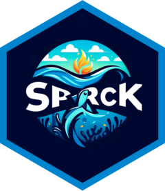

<!-- README.md is generated from README.Rmd. Please edit that file -->

```{r, setup, include = FALSE}
knitr::opts_chunk$set(
  collapse = TRUE,
  comment = "#>",
  fig.path = "man/figures/README-",
  out.width = "100%"
)
```

# spark 

### Support Package for Analysis, Research and Knowledge

<!-- badges: start -->
[](https://lifecycle.r-lib.org/articles/stages.html#experimental)
[](https://CRAN.R-project.org/package=spark)
<!-- badges: end -->

This package aims to provide support to our work through the availability of a several standardised functions for divers manipulations and analysis. Take a look inside the online document to overview the panel of possibilities and don't hesitate to share your needs in terms of future development.    

## Installation

For an installation of the package from the last validated version like so:

```{r, stable installation, eval=FALSE, echo=TRUE}
devtools::install_github("https://github.com/umr-marbec/spark")
```

You can install the development version of spark through the following code. Be aware that the development version could have the last functions and feather available, but the stability or the global process of development is not validated yet.

``` {r, developement installation, eval=FALSE, echo=TRUE}
devtools::install_github("https://github.com/umr-marbec/spark",
                         ref = "development")
```

## Support and improvement

If you need any support, encounter any bug or you would like to add enhancements or suggestions of improvements, you can use the [GitHub issues](https://github.com/umr-marbec/spark/issues) page. 
