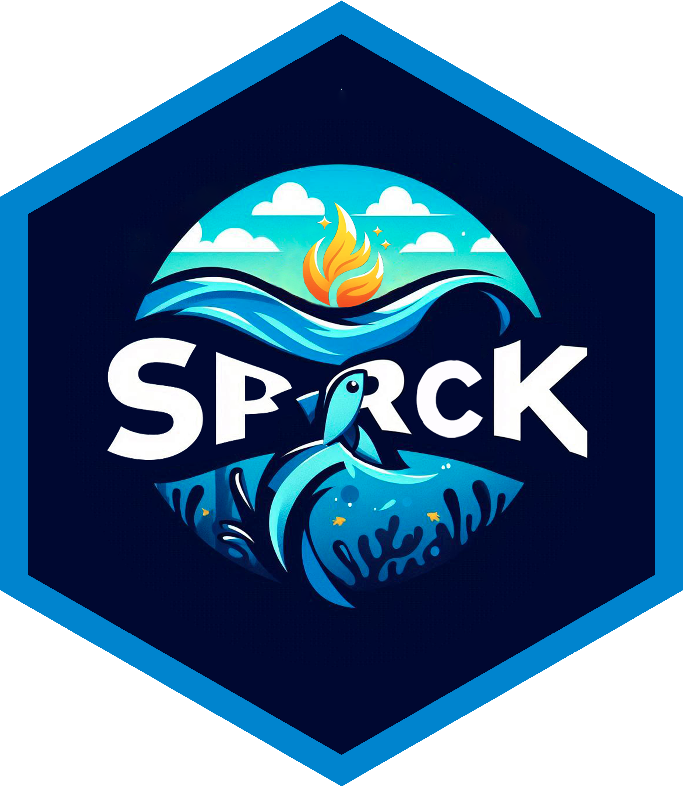

<!-- README.md is generated from README.Rmd. Please edit that file -->

# sparck <a href="https://umr-marbec.github.io/sparck/"></a>

### Support Package for Analysis, Research, Collaboration and Knowledge

<!-- badges: start -->

[](https://github.com/umr-marbec/sparck)
[](https://lifecycle.r-lib.org/articles/stages.html#experimental)
[](https://github.com/umr-marbec/sparck/actions/workflows/R-CMD-check.yaml)
[](https://github.com/umr-marbec/sparck/issues)
[](https://github.com/umr-marbec/sparck/actions/workflows/test-coverage.yaml)
<!-- badges: end -->

A system to provide support to your work through the availability of a
several standardised functions for divers manipulations and analysis.
Take a look inside the online document to overview the panel of
possibilities and don’t hesitate to share your needs in terms of future
development.

## Installation

For an installation of the package from the last validated version like
so:

``` r
devtools::install_github("https://github.com/umr-marbec/sparck")
```

## Support and improvement

If you need any support, encounter any bug or you would like to add
enhancements or suggestions of improvements, you can use the
<a href="https://github.com/umr-marbec/sparck/issues" class="external"
target="_blank">GitHub issues</a> page.
